<div align="center">



<br/>

<a href="https://nicobraun.net"></a>&nbsp;
<a href="https://linkedin.com/in/-nico-braun"></a>&nbsp;
<a href="mailto:sales@nicobraun.net"></a>&nbsp;
&nbsp;


</div>

---

### `// PROFILE`

Independent freelance consultant. I design and operate **secure, scalable cloud platforms** on **Microsoft Azure** — with depth in **data engineering**, **DevOps** and **applied AI**. Currently building **agentic AI** systems: multi-agent workflows, RAG, and LLM-driven automation.

```yaml
role:          Freelance Senior Consultant — Azure · Data · AI
based:         Würzburg, Germany
experience:    6+ years  ·  20+ delivered projects
certified:     13× Microsoft Azure  (incl. 3× Expert)
education:     M.Sc. — Data Analysis & Artificial Intelligence
languages:     German (native)  ·  English (business fluent)
industries:    Pharma · Energy · Finance · Automotive · Retail · Logistics
status:        ● available for engagements
```

---

### `// SERVICES`

| | | |
|---|---|---|
| **Cloud Architecture** | Secure, scalable Azure landing zones & governance | `Azure · IaC · Hub-Spoke` |
| **DevOps & Automation** | CI/CD pipelines, Infrastructure as Code, DevSecOps | `Terraform · K8s · Pipelines` |
| **AI Automation** | Agentic AI, LLMs, RAG & intelligent workflows | `LangGraph · CrewAI · Azure OpenAI` |
| **Data Engineering** | Cloud-native platforms, streaming, ETL/ELT | `Databricks · Kafka · Spark` |
| **Requirements Engineering** | Business analysis & stakeholder management | `BPMN · Discovery · Specs` |

<sub>Full breakdown → **[nicobraun.net/services](https://nicobraun.net/services)**</sub>

---

### `// STACK`

**Cloud & Infrastructure**


**DevOps & Observability**


**Data Engineering**


**AI / ML & Agentic AI**


---

### `// CERTIFICATIONS`  `13× MICROSOFT`

| Track | Certifications |
|---|---|
| **Architecture & Infra** | `AZ-900` · `AZ-104` · `AZ-700` · **`AZ-305` Solutions Architect Expert** |
| **DevOps** | **`AZ-400` DevOps Engineer Expert** |
| **Data & AI** | `DP-900` · `AI-900` · `DP-203` · `AI-102` · `DP-100` |
| **Security** | `SC-900` · `AZ-500` · **`SC-100` Cybersecurity Architect Expert** |

---

### `// FOCUS`

<div align="center">



</div>

---

<div align="center">
<sub>Open for freelance engagements. &nbsp;·&nbsp; <a href="https://nicobraun.net">nicobraun.net</a> &nbsp;·&nbsp; <a href="mailto:sales@nicobraun.net">sales@nicobraun.net</a></sub>
</div>
